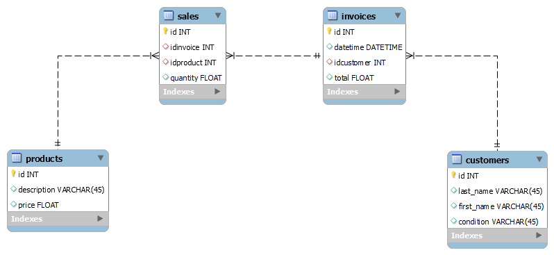

## Desafio de fechamento 💥💻 ##

*Bancos de dados - Implementação*

### Desafio ###

No sistema de vendas da Fantasy Products, os dados do banco de dados foram perdidos, mas antes que isso acontecesse, alguém conseguiu fazer o download de alguns arquivos .json que se referem às tabelas que foram excluídas.

Esse é o DER do sistema:


### Problema ###

Encontramos um banco de dados de projeto para começar dentro da pasta de dados que tem 4 arquivos, ou seja, 4 tabelas (sales.json, products.json, invoices.json, customers.json), cada uma delas com os registros dessa tabela, juntamente com um script sql para criar o banco de dados.

Por sua vez, há uma estrutura de API com alguns métodos já implementados (**Create** e **ReadAll**).

Os campos e a ordem de cada tabela são conhecidos:

- **sales.json** 💸 id, product_id, invoice_id, quantity                        
- **products.json** 🛒 id,description,price                                                
- **invoices.json** 🧾 id,datetime,customer_id,total                                        
- **customers.json** 👨‍💼 id,first_name,last_name,condition      

### 💡 Objetivos ###

Para aumentar o banco de dados, podemos usar o seguinte comando em um terminal na base do projeto:

```
sudo mysql -u root -p -v < ./docs/db/mysql/database.sql
```


Como você deve ter notado, a tabela de **invoices** perdeu os dados totais, portanto, é necessário que possamos recalcular com os dados que você tem entre **sales, invoices e products**.

Execute as seguintes tarefas:

- Crie uma app que permita carregar os dados json no respectivo armazenamento.
- Crie um método de endpoint que permita atualizar os dados das faturas.


### 💡 Novas consultas a serem realizadas: ###

1) Valores totais arredondados para 2 casas decimais por **condition** do **customer**

    *Saída esperada*
    | Condition       | Total     |
    |-----------------|-----------|
    | Inactivo (0)    | 605929.10 |
    | Activo (1)      | 716792.33 |


2) Top **5** dos **products** mais vendidos e suas quantidades vendidas

    *Saída esperada*    
    | Description                | Total |
    |----------------------------|-------|
    | Vinegar - Raspberry        | 660   |
    | Flour - Corn, Fine         | 521   |
    | Cookie - Oatmeal           | 467   |
    | Pepper - Red Chili         | 439   |
    | Chocolate - Milk Coating   | 436   |

3) Top 5 dos **customers ativos** quem gastou mais dinheiro    

    *Saída esperada* 
    | First Name | Last name | Amount    |
    |------------|-----------|-----------|
    | Lannie     | Tortis    | 58513.55  |
    | Jasen      | Crowcum   | 48291.03  |
    | Elvina     | Ovell     | 43590.75  |
    | Lazaro     | Anstis    | 40792.06  |
    | Wilden     | Oaten     | 39786.79  |

 

- Realizar testes de unidade nas novas funcionalidades a serem incorporadas nos **storages** respetivos, usando o package **go-txdb** (Observação: algumas consultas usam **inner join**)

- Crie **handlers** e registre-os nos **endpoints**.